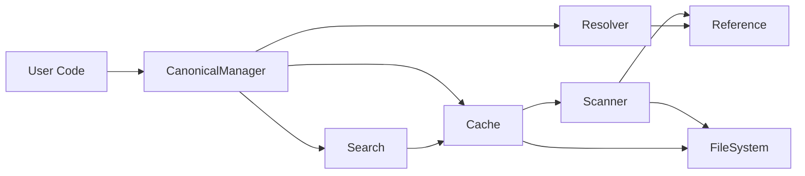

# API Reference

## Overview

FHIR Canonical Manager provides a modular API organized into 9 distinct components. Each module has specific responsibilities and can be used independently or together through the main `CanonicalManager` interface.

## Main Exports

```typescript
// Main factory function
import { CanonicalManager } from '@atomic-ehr/fhir-canonical-manager';

// Alternative imports
import { createCanonicalManager } from '@atomic-ehr/fhir-canonical-manager';

// Type imports
import type { 
  CanonicalManager,
  IndexEntry,
  Resource,
  PackageId,
  Reference
} from '@atomic-ehr/fhir-canonical-manager';
```

## Module Documentation

The API is organized into the following modules:

### Core Components
- **[CanonicalManager](./api/manager.md)** - Main orchestration layer
- **[Types](./api/types.md)** - TypeScript interfaces and type definitions
- **[Reference Manager](./api/reference.md)** - Reference ID management

### Infrastructure
- **[Cache](./api/cache.md)** - Caching layer with persistence
- **[File System](./api/fs.md)** - File system utilities
- **[Package Manager](./api/package.md)** - NPM package installation

### Processing
- **[Scanner](./api/scanner.md)** - Package discovery and indexing
- **[Resolver](./api/resolver.md)** - Canonical URL resolution
- **[Search](./api/search.md)** - Smart search functionality

## Quick Start

### Basic Usage

```typescript
import { CanonicalManager } from '@atomic-ehr/fhir-canonical-manager';

// Create manager instance
const manager = CanonicalManager({
  packages: ['hl7.fhir.r4.core@4.0.1'],
  workingDir: './fhir-cache'
});

// Initialize (installs packages, builds index)
await manager.init();

// Resolve a canonical URL
const patient = await manager.resolve(
  'http://hl7.org/fhir/StructureDefinition/Patient'
);

// Search for resources
const results = await manager.smartSearch(['str', 'def', 'pati']);

// Clean up
await manager.destroy();
```

### Smart Search

```typescript
// Search with abbreviations
const results = await manager.smartSearch(['obs']);  // Finds Observation

// Search with filters
const valuesets = await manager.smartSearch(['value'], {
  resourceType: 'ValueSet'
});

// Search by kind
const resources = await manager.smartSearch(['patient'], {
  kind: 'resource'
});
```

### Package Management

```typescript
// List installed packages
const packages = await manager.packages();

// Resolve from specific package
const resource = await manager.resolve(url, {
  package: 'hl7.fhir.us.core'
});
```

## Error Handling

All async methods may throw:

- `Error: CanonicalManager not initialized` - Call `init()` first
- `Error: Cannot resolve canonical URL` - Resource not found
- `Error: Invalid reference ID` - Bad reference format
- File system errors - Permission issues
- Network errors - Package installation failures

```typescript
try {
  await manager.init();
  const resource = await manager.resolve(url);
} catch (error) {
  console.error('Failed:', error.message);
} finally {
  await manager.destroy();
}
```

## Module Architecture



## Performance Characteristics

- **Resolution**: O(1) hash lookup
- **Smart Search**: O(n) where n = total entries
- **Cache Load**: ~50ms for 5,000 entries
- **Memory Usage**: ~10MB for 5,000 resources

## See Also

- [Architecture Documentation](./architecture.md)
- [CLI Reference](./cli-reference.md)
- [Testing Guide](./testing.md)
- [Implementation Details](./implementation.md)