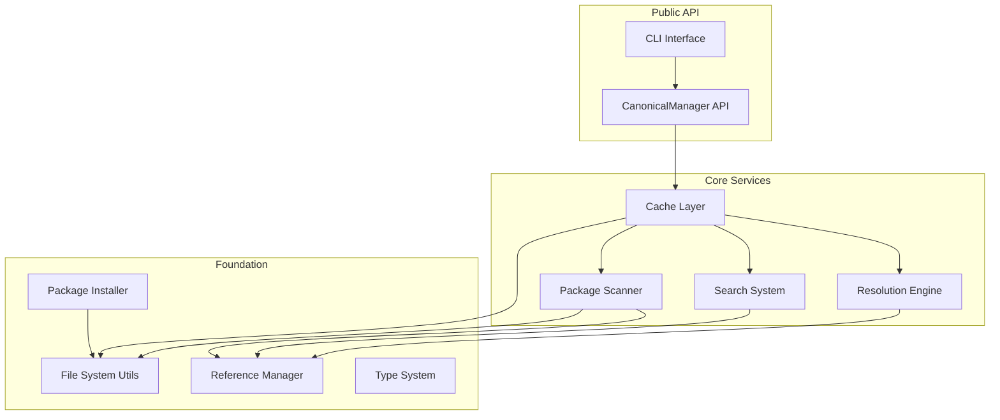

# Architecture

## Overview

FHIR Canonical Manager follows a modular, component-based architecture as defined in [ADR-003](../adr/003-modular-architecture.md). The system has been refactored from a monolithic structure to a clean separation of concerns with 9 key modules.

## System Architecture



## Module Structure

### 1. Type System (`src/types/`)
**Purpose**: Define all TypeScript interfaces and types

**Components**:
- `core.ts` - Public API types (Reference, Resource, IndexEntry, etc.)
- `internal.ts` - Internal implementation types

**Dependencies**: None

### 2. Reference Manager (`src/reference.ts`)
**Purpose**: Manage unique resource identifiers and URL mappings

**Components**:
- `store.ts` - Reference ID generation
- `manager.ts` - Reference manager factory

**Key Features**:
- SHA256-based ID generation
- URL to ID mapping
- Reference metadata storage

### 3. Cache Layer (`src/cache/`)
**Purpose**: Provide in-memory and persistent caching

**Components**:
- `core.ts` - Cache creation and management
- `persistence.ts` - Disk persistence
- `validation.ts` - Cache validation and hash computation

**Key Features**:
- In-memory index cache
- Persistent disk storage
- Package-lock.json hash validation
- Automatic cache invalidation

### 4. File System Utilities (`src/fs/`)
**Purpose**: Abstract file system operations

**Components**:
- `utils.ts` - Basic file operations

**Key Features**:
- File existence checking
- Directory creation
- FHIR package detection

### 5. Package Scanner (`src/scanner/`)
**Purpose**: Discover and index FHIR packages

**Components**:
- `parser.ts` - Index file parsing and validation
- `processor.ts` - Index processing
- `package.ts` - Package scanning
- `directory.ts` - Directory traversal

**Key Features**:
- Recursive package discovery
- Index validation
- Scoped package support

### 6. Resolution Engine (`src/resolver.ts`)
**Purpose**: Resolve canonical URLs to resources

**Components**:
- `context.ts` - Context-aware resolution

**Key Features**:
- Package-specific resolution
- Context-based lookups
- Fallback strategies

### 7. Search System (`src/search/`)
**Purpose**: Provide intelligent resource search

**Components**:
- `smart.ts` - Smart search implementation
- `terms.ts` - Abbreviation expansions

**Key Features**:
- Abbreviation expansion (e.g., "str" → "structure")
- Multi-term AND logic
- Type and kind filtering
- Case-insensitive matching

### 8. Package Manager (`src/package/`)
**Purpose**: Install and manage NPM packages

**Components**:
- `detector.ts` - Package manager detection
- `installer.ts` - Package installation

**Key Features**:
- Bun/npm detection
- Registry configuration
- Auth bypass for FHIR registry

### 9. Manager (`src/manager/`)
**Purpose**: Orchestrate all components

**Components**:
- `canonical.ts` - Main CanonicalManager implementation

**Key Features**:
- Component initialization
- API coordination
- Lifecycle management

## Data Flow

### 1. Initialization Flow
```
CanonicalManager.init()
  → Check cache validity
  → Install packages (if needed)
  → Scan packages
  → Build index
  → Save cache
```

### 2. Resolution Flow
```
resolve(url)
  → Check context
  → Query cache
  → Filter results
  → Read resource
  → Return data
```

### 3. Search Flow
```
smartSearch(terms)
  → Expand abbreviations
  → Filter cache entries
  → Apply filters
  → Return matches
```

## Design Principles

### 1. Separation of Concerns
Each module has a single, well-defined responsibility.

### 2. Dependency Inversion
High-level modules don't depend on low-level modules; both depend on abstractions.

### 3. Interface Segregation
Modules expose minimal, focused interfaces.

### 4. Open/Closed Principle
Modules are open for extension but closed for modification.

### 5. Functional Core
Most operations are pure functions with predictable outputs.

## Performance Characteristics

### Memory Usage
- **Index Cache**: ~10MB for 5,000 resources
- **Reference Store**: ~5MB for 5,000 references
- **Package Metadata**: ~1MB per 100 packages

### Operation Performance
- **Resolution**: O(1) hash lookup
- **Search**: O(n) where n = total entries
- **Smart Search**: O(n*m) where m = search terms
- **Cache Load**: ~50ms for 5,000 entries
- **Cache Save**: ~100ms for 5,000 entries

## Error Handling

### Strategy
- **Graceful Degradation**: Operations fail safely
- **Silent Failures**: Scanner ignores invalid packages
- **Explicit Errors**: API throws for critical failures

### Error Types
1. **Initialization Errors**: Missing packages, invalid config
2. **Resolution Errors**: URL not found, invalid reference
3. **Cache Errors**: Corruption, version mismatch
4. **Network Errors**: Package installation failures

## Security Considerations

### Package Installation
- Uses official NPM/FHIR registries
- Auth bypass only for FHIR registry
- No execution of package code

### File System
- Restricted to working directory
- No symbolic link following
- Safe path resolution

### Cache Security
- Hash validation for integrity
- No sensitive data storage
- User-scoped cache directories

## Extensibility Points

### 1. Custom Package Sources
Extend `PackageInstaller` to support additional registries.

### 2. Alternative Cache Backends
Implement `CacheStore` interface for Redis, etc.

### 3. Search Plugins
Add custom search strategies to `SearchEngine`.

### 4. Resolution Strategies
Extend `Resolver` with custom resolution logic.

## Future Enhancements

1. **Parallel Processing**: Multi-threaded package scanning
2. **Incremental Updates**: Partial cache updates
3. **Remote Cache**: Shared cache across instances
4. **GraphQL API**: Alternative query interface
5. **WebAssembly**: Performance-critical paths in WASM